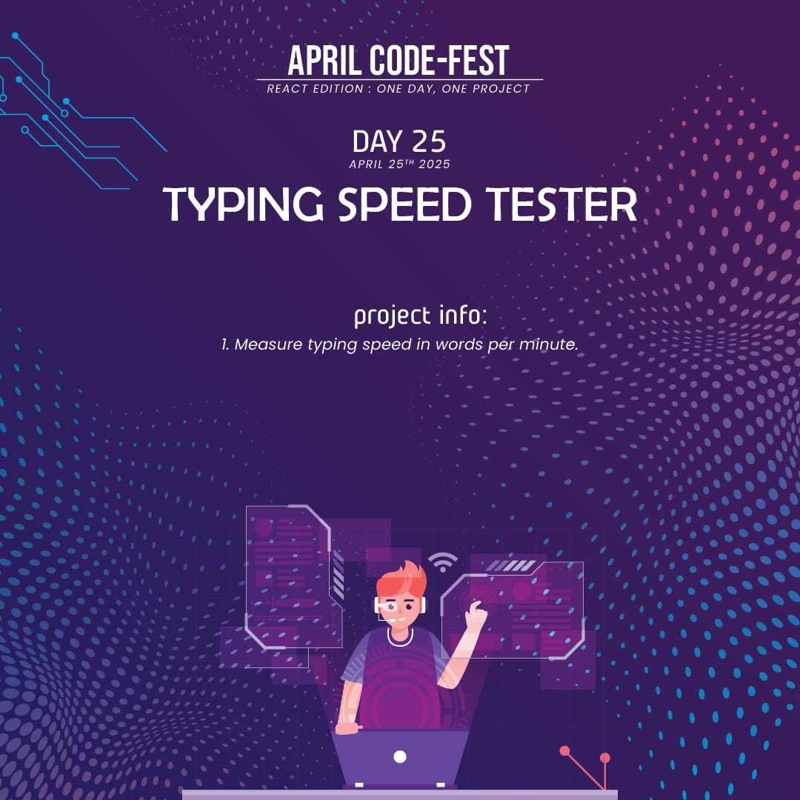
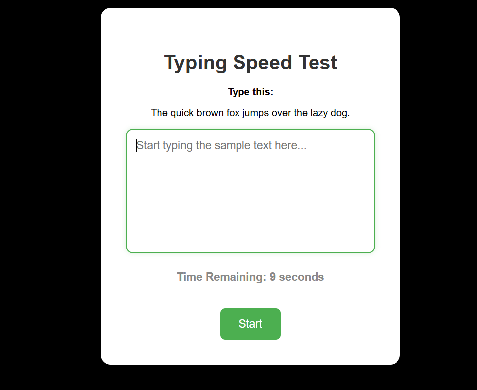

# ⌨️ Typing Speed Test

A sleek and engaging **React app** to test your typing speed. See how fast (and accurately) you can type within a time limit. Includes real-time countdown and WPM (Words Per Minute) calculation.

---

## 📌 Features
- ✅ **Live Countdown Timer**: Default 20-second test duration.
- ✅ **Word Count & WPM Calculation**: Measures words typed and speed.
- ✅ **Auto Focus & Reset**: Textarea focuses and clears on every restart.
- ✅ **Responsive UI**: Works smoothly on all devices.

---

## 🛠️ Technologies Used
- ⚛️ **React**
- 🎨 **CSS** (`Typing.css` for styling)
- ⏱️ **useEffect** for timer logic

---
## 🚀 Live Demo
To see it in action, clone the repository and follow the setup instructions below.

1. *Clone the repository:*

   ```bash
   git clone https://github.com/Eshhaa11/typing-speed-tester

2. *Navigate to the project directory:*

   cd typing-speed-tester

3. *Install dependencies:*

   npm install

4. *Start the development server:*

   npm start

5. *Open your browser and visit:*

   http://localhost:3000

---

 ## 🎨 Screenshots:
 


 ---

 ## 🤝 Contributing:
 Want to improve this project? Fork the repository, create a feature branch, and open a pull request. All contributions are welcome! 🚀✨
 
 ---

 🎉 Happy Coding